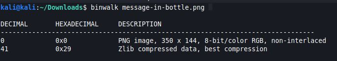
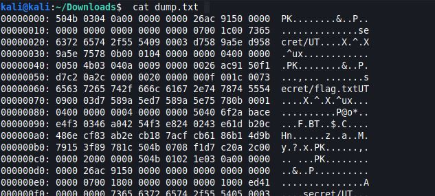

# Digital Forensics 
## G&P List 
Just Open the File and Capture the flag . Submission in MD5

* First thing thought of ofc is to use the command exiftool to see more info about the file. 


We can see clearly that the file type is Zip. Let's unzip it. 


The flag is in Flag.txt 


## Hidden Message 
A cyber Criminal is hiding information in the below file . capture the flag ? submit Flag in MD5 Format

* Just use exiftool command and instantly get the flag 


## Cypher Anxiety 
An image was leaked from a babies store. the manager is so annoyed because he needs to identify the image to fire charges against the responsible employee. the key is the md5 of the image

* Download and unzip the file, we get a pcap file which is used to capture network traffic. 
* Then, we open it using wireshark. 
* If we navigate a little through the packets we'll find this : 


* So, let's see what strings will tell us : 


As the message says, we should filter with port number 7070 and use cryptcat to decrypt the data sent. 


Then follow tcp stream and save it as raw. 


* We use the command : ```netcat localhost 7070 < crypted.file``` to listen in port 7070.
* And we use : ```cryptcat -l -k P@ssawordaya -p 7070 > decrypted``` to get decrypted data. 
We should be able to the image leaked now. 
* To get the flag we need to get the md5 of the image using the command : ```md5sum decrypted```


## Message in a bottle
That's so easy. Just Capture the Flag.

* When we run the command ```binwalk message-in-bottle.png``` we get the following : 



So we are sure that there are more than just an image in this file. 
We use Openstego to try and extract the files inside : 


* The output file is a text file named Flag.txt which ofc contains our flag. 


## I love images
A hacker left us something that allows us to track him in this image, can you find it?

* We run the command ```pngcheck bogot.png``` to check if the image is corrupted.


* Then we run the command ```strings bogot.png``` to see if there is any strings whithin the image. 


* We notice that after IEND we still have base32 encoded data (we can tell by the "="), if we decode it we get the flag. 


## bflag 
All of us started from the bottom. Now it's your turn.

* Before we head to wireshark, let's run the command ```foremost bflag.pcap``` and see if we'll find some useful file. 


* After looking around all these files, we find this : 


## Search in Trash 
My HDD was destroyed in an accident. However, I was able to recover my recycle bin file . Can you know the flag ?

* First thing to do is run the command ```file search-trash``` to know which type of file is this. 


* We use the command ```rifuiti2 search-trash``` that's used to extract file deletion time, original path and size of deleted files. 


## You have been hacked 
we can hide secret messages, try to capture the flag. Submit answer in MD5.

* Just use openstego and extract the hidden file named ```Flag.txt```

## Keep it simple 
The answer is simple

I really enjoyed working on this one, as it says it's very simple but also confusing. 


* The flag was hidden in the image shown on top of the password input area. 
* Download the image and run the command ```exiftool the_eye.jpeg```


## Anonymous 
Can you trace the anonymous guy? 

* Download the file and run the command ```strings anonymous.pcap``` . 


* The flag is Base64 encoded, decode it and submit. 


## X-File
someone hiding a secret in this file. can you help me to recover the flag from the secret. 

* First look at the file we know that it's hex encoded so we need to decode it first. 



* We use the command ```cat dump.txt | xxd -r > rev``` to decode it. 
* When we run the command ```file rev```, we figure out that it's a ZIP file and it's protected with a password. So we need to crack it. 
* We run the command ```zip2john rev > rev.hash``` to get the hashed password out of the zip archive.
* Then we crack it using ```john rev.hash```. 


* Now Let's unzip it and get the flag :) . 


